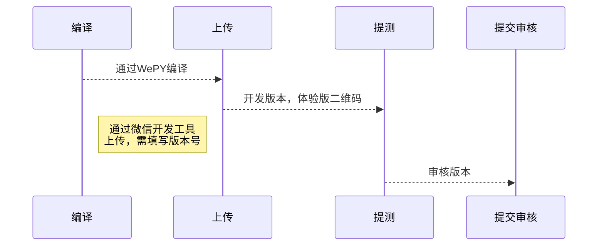

[TOC]

# Beauty Lite

基于 [WePY 2](https://github.com/Tencent/wepy) (小程序组件化开发框架) 开发的一个微信小程序。

## Develop

开发步骤如下：

1. `npm run watch` 进入监听模式
2. 通过 [微信开发者工具](https://developers.weixin.qq.com/miniprogram/dev/devtools/download.html) 进行调试

## Build

主要由 [@wepy/cli](https://github.com/Tencent/wepy/tree/2.0.x/packages/cli) 工具编译完成。

| 模式  | 命令  | 备注 |
|---|---|---|
| 监听 | `npm run watch` | -- |
| 构建 | `npm run build` | -- |

## Deploy

微信小程序（可到[微信公众平台](https://mp.weixin.qq.com/cgi-bin/wx?token=&lang=zh_CN)查看）部署流程如下：

> 微信公众平台: [https://mp.weixin.qq.com/](https://mp.weixin.qq.com/)

## Format

- 格式化保存代码：可通过 VS code的快捷键【**Shift + Commnad + f**】 或 右击菜单的【格式化代码】选项执行，然后保存代码。
- `npm run lint`：用来检测代码预定的规范，保证代码的一致性，避免错误。

## Test

> ### TODO
> 需要对一些特定模块或组件进行单元测试

